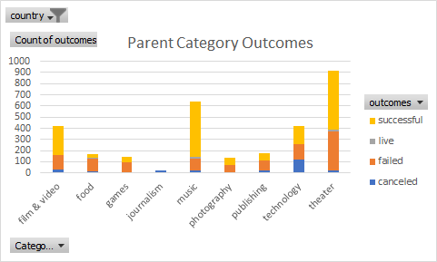
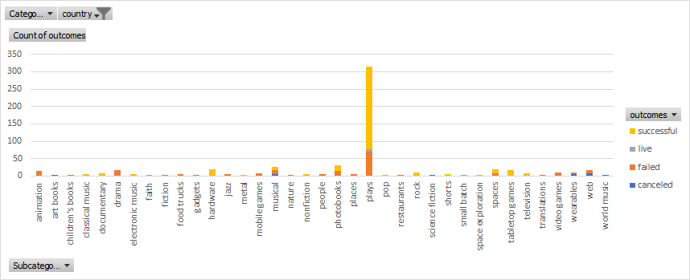
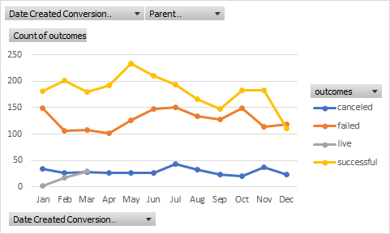

# Kickstarter-Analysis
Performing Analysis on Kickstarter Data to Uncover Trends
 
### Recommendations for a successful kickstarter campaign for plays:

* Staying under $4,000 goal of producing a play
* Launching kickstarter campaign in May 
* Keeping kickstarter goal around $2k (median mark for successful kickstarter play campaigns)

#### Images & Links

Parent Category by Outcome

Subcategory by Outcome

Outcomes by Month

Excel Analysis 

[kickstarter-analysis](docs/kickstarter-analysis.xlsx)
